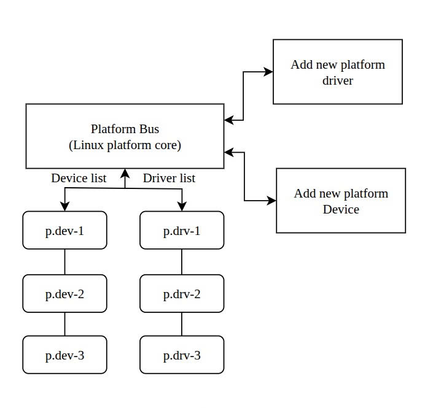
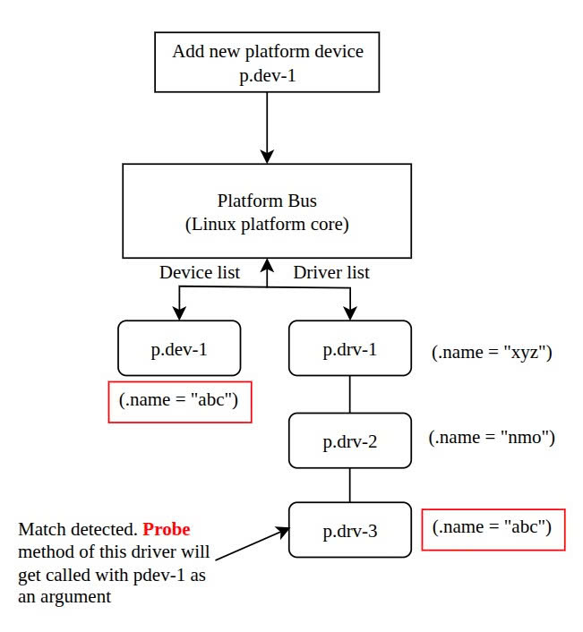

# Platform devices and drivers

## Platform bus
- Platform bus is a pseudo bus or virtual bus. It doesn't have any physical existence.
- This is a Linux terminology representing bus interfaces that do not have **auto discoverable** and **hot plugging capability**.

## Platform devices
- Devices which are connected to the platform bus are called platform devices
- A device if its parent bus doesn’t support enumeration of connected devices then it becomes a platform device

## Platform driver
- A driver who is in charge of handling a platform device is called a platform driver

### Discovery of devices
- Every device has its configuration data and resources, which need to be reported to the OS, which is running on the computer system.
- An operating system such as Windows or Linux, running on the computer, can auto-discover these data. Thus the OS learn about the connected devices automatically (Device enumeration).
- Enumeration is a process through which the OS can inquire and receive information, such as the type of the device, the manufacturer, device configuration, and all the devices connected to a given bus.
- Once the OS gathers information about a device, it can autoload the appropriate driver for the device. In the PC scenario, buses like PCI and USB support auto enumeration/hotplugging of devices.
- However, on embedded system platforms, this may not be the case since most peripherals are connected to the CPU over buses that don’t support auto-discovery or enumeration of devices. We call them as platform devices.
- All these platform devices which are non-discoverable by nature, but they must be part of the Linux device model, so the **information about these devices** must be fed to the Linux kernel manually either at compile time or at boot time of the kernel.

### Device information
- Memory or I/O mapped base address and range information
- IRQ number on which the device issues interrupt to the processor
- Device identification information
- DMA channel information
- Device address
- Pin configuration
- Power, voltage parameters
- Other device specific data

### Adding Platform devices information to the kernel
**During compilation of kernel**
- Static method
- Hardware details are part of kernel files (board file, drivers)
- Deprecated and not recommended

**Loading dynamically**
- As a kernel module
- Not recommended

**During kernel boot**
- Device tree blob
- Latest and recommended

### Platform driver structure
````c
struct platform_driver {
    int (*probe)(struct platform_device *);
    void (*remove)(struct platform_device *);
    void (*shutdown)(struct platform_device *);
    int (*suspend)(struct platform_device *, pm_message_t state);
    int (*resume)(struct platform_device *);
    struct device_driver driver;
    const struct platform_device_id *id_table;
    bool prevent_deferred_probe;
    bool driver_managed_dma;
};
````
### Platform device structure
````c
struct platform_device {
    const char	*name;
    int		id;
    bool		id_auto;
    struct device	dev;
    u64		platform_dma_mask;
    struct device_dma_parameters dma_parms;
    u32		num_resources;
    struct resource	*resource;

    const struct platform_device_id	*id_entry;
    /*
     * Driver name to force a match.  Do not set directly, because core
     * frees it.  Use driver_set_override() to set or clear it.
     */
    const char *driver_override;

    /* MFD cell pointer */
    struct mfd_cell *mfd_cell;

    /* arch specific additions */
    struct pdev_archdata	archdata;
};
````

### A simple "name" based matching
<p align="center">
  
</p>

- The Linux platform core implementation maintains platform device and driver lists. Whenever you add a new platform device or driver, this list gets updated and matching mechanism triggers.

- Every bus type has its match function, where the device and driver list will be scanned.

<p align="center">
  
</p>

### Points to remember
- Whenever a new device or a new driver is added, the matching code of the platform bus core runs, and if the platform bus core finds a matching platform device for a platform driver, the probe function of the matched driver will get called. Inside the probe function, the driver configures the detected device.
- Details of the matched platform device will be passed to the probe function of the matched driver so that driver can extract the platform data and configure it.

### Probe function of the platform driver
````c
int (*probe)(struct platform_device *);
````
- Probe function must be implemented by the platform driver and should be registered during `platform_driver_register()`.
- When the bus matching function detects the matching device and driver, probe function of the driver gets called with **detected platform device as an input argument.**
- Note that `probe()` should in general, verify that the specified device hardware actually exists. Sometimes platform setup code can’t be sure. The probing can use device resources, including clocks, and device platform_data.
- The probe function is responsible for
    - Device detection and initialization
    - Allocation of memories for various data structures,
    - Mapping i/o memory
    - Registering interrupt handlers
    - Registering device to kernel framework, user level access point creations, etc
- The probe may return 0(success) or error code. If probe function returns a non-zero value, meaning probing of a device has failed.

### Remove function of the platform driver
````c
void (*remove)(struct platform_device *);
````
- Remove function gets called when a platform device is removed from the kernel to unbind a device from the driver or when the kernel no longer uses the platform device
- Remove function is responsible for
    - Unregistering the device from the kernel framework
    - Free memory if allocated on behalf of a device
    - Shutdown/De-initialize the device

## Matching of platform driver and device using "platform device ids"

**Use case: Different versions of a chip**

````c
struct platform_device_id {
	char name[PLATFORM_NAME_SIZE];
	kernel_ulong_t driver_data;
};
````
Example:
````c
struct platform_device_id pcdevs_ids[] =
{
  {.name = "pcdev-A1x", .driver_data = PCDEVA1X},
  {.name = "pcdev-B1x", .driver_data = PCDEVB1X},

  {   }
};
````

And use it in `struct platform_driver`
````c
const struct platform_device_id *id_table;
````

Example in my case:
````c
struct platform_driver pcd_platform_driver =
{
    .probe  = pcd_platform_driver_probe,
    .remove = pcd_platform_driver_remove,
    .id_table = pcdevs_ids,
    .driver = {
        .name = "pseudo-char-device"
    }
};
````

***platform_match - bind platform device to platform driver***

````c
/**
 * platform_match - bind platform device to platform driver.
 * @dev: device.
 * @drv: driver.
 *
 * Platform device IDs are assumed to be encoded like this:
 * "<name><instance>", where <name> is a short description of the type of
 * device, like "pci" or "floppy", and <instance> is the enumerated
 * instance of the device, like '0' or '42'.  Driver IDs are simply
 * "<name>".  So, extract the <name> from the platform_device structure,
 * and compare it against the name of the driver. Return whether they match
 * or not.
 */
static int platform_match(struct device *dev, const struct device_driver *drv)
{
	struct platform_device *pdev = to_platform_device(dev);
	struct platform_driver *pdrv = to_platform_driver(drv);

	/* When driver_override is set, only bind to the matching driver */
	if (pdev->driver_override)
		return !strcmp(pdev->driver_override, drv->name);

	/* Attempt an OF style match first */
	if (of_driver_match_device(dev, drv))
		return 1;

	/* Then try ACPI style match */
	if (acpi_driver_match_device(dev, drv))
		return 1;

	/* Then try to match against the id table */
	if (pdrv->id_table)
		return platform_match_id(pdrv->id_table, pdev) != NULL;

	/* fall-back to driver name match */
	return (strcmp(pdev->name, drv->name) == 0);
}
````

````c
/* module_platform_driver() - Helper macro for drivers that don't do
 * anything special in module init/exit.  This eliminates a lot of
 * boilerplate.  Each module may only use this macro once, and
 * calling it replaces module_init() and module_exit()
 */
#define module_platform_driver(__platform_driver) \
	module_driver(__platform_driver, platform_driver_register, \
			platform_driver_unregister)
````

````c
/**
 * module_driver() - Helper macro for drivers that don't do anything
 * special in module init/exit. This eliminates a lot of boilerplate.
 * Each module may only use this macro once, and calling it replaces
 * module_init() and module_exit().
 *
 * @__driver: driver name
 * @__register: register function for this driver type
 * @__unregister: unregister function for this driver type
 * @...: Additional arguments to be passed to __register and __unregister.
 *
 * Use this macro to construct bus specific macros for registering
 * drivers, and do not use it on its own.
 */
#define module_driver(__driver, __register, __unregister, ...) \
static int __init __driver##_init(void) \
{ \
	return __register(&(__driver) , ##__VA_ARGS__); \
} \
module_init(__driver##_init); \
static void __exit __driver##_exit(void) \
{ \
	__unregister(&(__driver) , ##__VA_ARGS__); \
} \
module_exit(__driver##_exit);
````